# CDD (Crack Detection Drone) 
### 드론에 부착하여 균열 탐지를 수행할 수 있도록 하는 AIoT 서비스
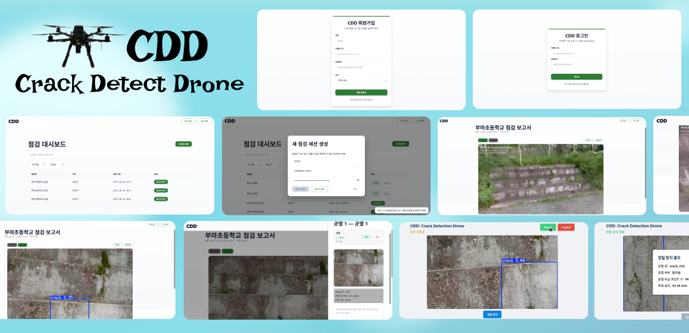
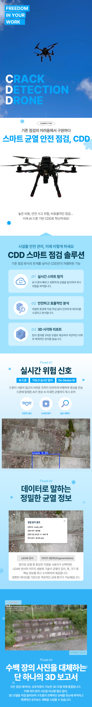

  

## 📝 개요
#### 기간 : 7/14 - 8/17
#### 인원 : 6명 (팀장: 문소윤, 팀원: 문빈, 유승현, 장철환, 조정래, 진효창)

  

## 🚀 프로젝트 시연 영상

아래 이미지를 클릭하면 영상이 재생됩니다.

  

## 🤔 기획배경
그동안의 균열 탐지 방법은 사람이 직접 눈으로 확인하는 방식이었습니다. 하지만 이러한 방식은 비용과 많은 시간이 필요하고 많은 사람이 필요했습니다. 이 때문에 자주 검사할 수 없어 위험 요소를 뒤늦게 발견하기도 합니다. 
이러한 문제를 해결하기 위해 드론을 통해 균열을 탐지하고자 하였습니다. 드론에 고해상도 카메라와 AI 기반 균열 인식 시스템을 탑재하여 자동으로 균열을 감지하고, LiDAR 센서를 통해 균열의 깊이까지 정확하게 측정할 수 있도록 구현했습니다. 
수집된 데이터는 웹 기반 3D 시각화 플랫폼을 통해 사용자가 직관적으로 현장 상황을 파악할 수 있도록 제공됩니다. 사용자는 브라우저에서 3D 환경을 통해 균열의 위치, 크기, 심각도를 실시간으로 확인하고 분석할 수 있습니다. 
이를 통해 기존 방식 대비 검사 시간을 크게 단축하고 비용을 절감하면서도, 위험 지역에 인력을 투입하지 않고도 정확하고 객관적인 구조물 안전 점검이 가능한 통합 솔루션을 구축하였습니다.

  

## ⚙️ **프로젝트 기능 상세 설명**

### **프로젝트 목표**

드론과 AI 비전 기술을 활용하여 **구조물 안전 점검 프로세스를 자동화** 하고, 이를 통해 **비용을 최적화** 하며 **안전 관리자의 업무 효율을 극대화** 하는 것을 목표로 합니다. 안전 점검원 및 관리자는 본 시스템을 통해 신속하고 정확하게 구조물의 균열 상태를 파악하고 관리할 수 있습니다.

---

### **1. 실시간 균열 탐지 (Real-time Crack Detection)**

개요

드론에 장착된 Jetson Orin Nano와 고해상도 카메라를 이용하여 촬영되는 영상을 실시간으로 분석합니다. 최신 객체 탐지 모델인 YOLOv8n을 통해 영상 내에 존재하는 균열을 신속하게 식별하고, 해당 위치를 **바운딩 박스(Bounding Box)** 로 표시하여 직관적으로 보여줍니다.

**주요 특징**

- **실시간 처리** : 현장에서 드론이 비행하며 촬영하는 즉시 균열 탐지가 수행되므로, 넓은 영역을 신속하게 스크리닝할 수 있습니다.
    
- **높은 기동성** : 드론을 활용하여 사람이 접근하기 어려운 교량 상판, 고층 건물 외벽 등 위험 구역도 안전하게 점검할 수 있습니다.
    
- **직관적인 시각화** : 탐지된 균열은 라이브 영상 위에 사각형 박스로 표시되어, 점검자가 즉시 위험 요소를 인지하고 다음 점검 단계를 결정할 수 있도록 돕습니다.
    

---

### **2. 정밀 균열 분석 (Precise Crack Analysis)**

개요

실시간 탐지 중 심층적인 분석이 필요하다고 판단되는 균열에 대해, 사용자가 '정밀 탐지' 기능을 실행하면 DeepLabV3 모델과 LiDAR 센서를 이용한 상세 분석이 진행됩니다. 이를 통해 균열의 형태, 면적, 깊이 등 정량적인 데이터를 확보합니다.

**주요 특징**

- **선택적 집중 분석** : 사용자가 직접 분석 대상을 선택하여, 중요도가 높은 균열에 대해서만 정밀 자원을 투입하는 효율적인 워크플로우를 제공합니다.
    
- **다중 센서 데이터 융합**:
    
    - **깊이 측정 (LiDAR)** : **YDLidar** 센서가 균열의 깊이를 즉각적으로 측정하여 현장에서 실시간으로 위험도를 평가할 수 있는 데이터를 제공합니다.
        
    - **형태 분석 (Segmentation)** : **DeepLabV3** 모델이 균열 영역을 픽셀 단위로 정밀하게 분할(Segmentation)합니다. 분석이 완료된 후, 웹 대시보드에서 해당 균열 영역이 **붉은색 마스크** 로 시각화되어 정확한 형태와 분포를 확인할 수 있습니다.
        
- **데이터 분리 제공** : LiDAR를 통한 깊이 값은 현장에서 즉시 확인 가능하며, 정밀한 형태 분석 결과는 후처리 후 웹에서 상세히 검토할 수 있습니다.
    

---

### **3. 3D 모델링 및 시각화 (3D Modeling & Visualization)**

개요

균열 탐지 과정에서 촬영된 전체 비행 영상을 활용하여 구조물 전체를 3D 모델로 자동 생성합니다. 3D Gaussian Splatting 기술을 적용하여, 사진 기반의 매우 사실적인 3D 환경을 구축하고 사용자가 웹 브라우저를 통해 언제 어디서든 현장을 확인할 수 있게 합니다.

**주요 특징**

- **사실적인 현장 구현** : 수집된 2D 이미지들을 3차원으로 재구성하여 마치 구글맵과 같이 ** 생생하고 사실적인 품질**의 3D 모델을 제공합니다.
    
- **자유로운 탐색** : 사용자는 키보드와 마우스를 이용해 3D 모델을 **자유롭게 회전, 확대, 축소** 하며 원하는 각도에서 구조물의 상태를 면밀히 살펴볼 수 있습니다.
    
- **데이터 이력 관리** : 점검이 완료된 구조물은 3D 모델로 아카이빙되며, 웹 인터페이스를 통해 해당 구조물에서 발견된 **균열 목록(List)을 함께 제공** 하여 체계적인 이력 관리가 가능합니다.
    
- **효율적인 처리** : 약 3시간의 처리 시간을 통해 영상 데이터를 상호작용 가능한 3D 자산으로 변환합니다.

  

## 아키텍처 소개
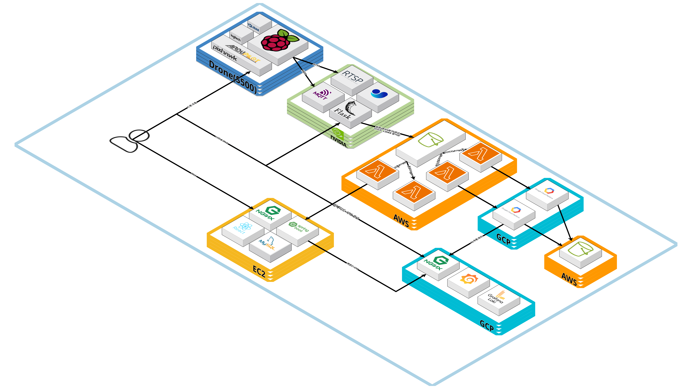

  

## 유저 플로우차트

  

## 팀 구성 및 역할

### 👨‍💼 문소윤 (팀장)

**역할:**  

**기술 스택:**

---

### 👨‍🔬 문빈

**역할:** 

**기술 스택:**

---

### 👨‍💻 유승현

**역할:**   

**기술 스택:**

---

### 👨‍💼 장철환

**역할:**   

**기술 스택:**

---

### 👨‍🔬 조정래

**역할:**  

**기술 스택:**

---

### 👨‍💻 진효창

**역할:**  

**기술 스택:**

  

## CDD 서비스 웹 페이지 상세
### **- LCD 화면 페이지**

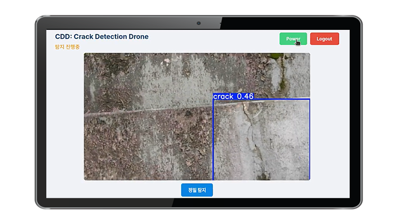
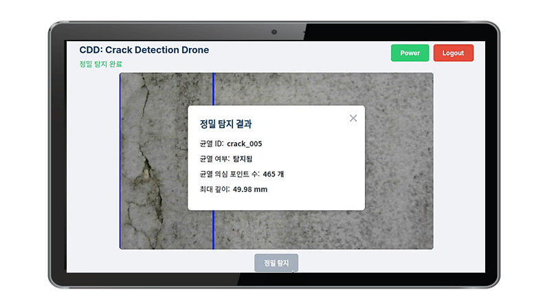
  

### **- 웹 페이지**
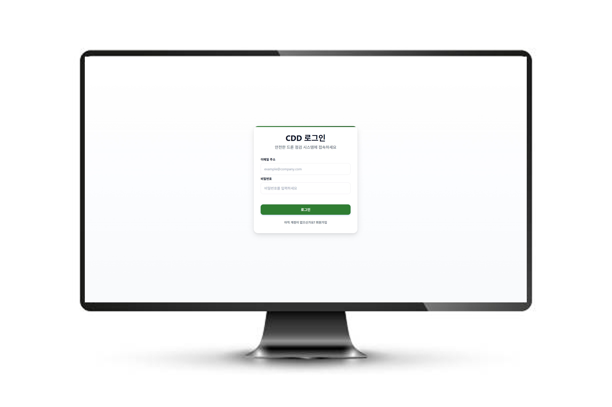
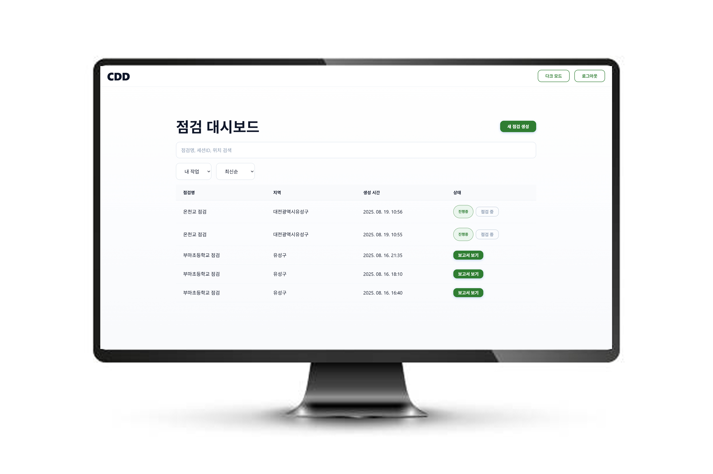
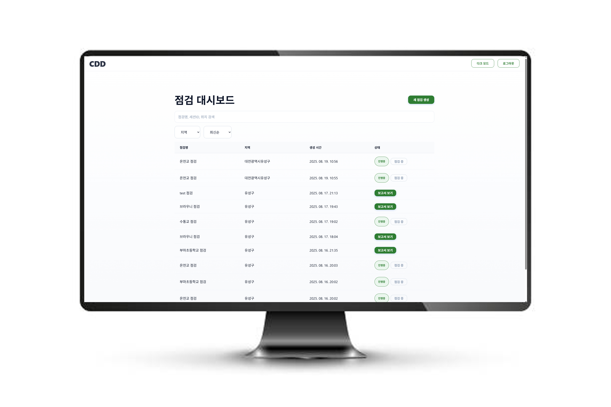
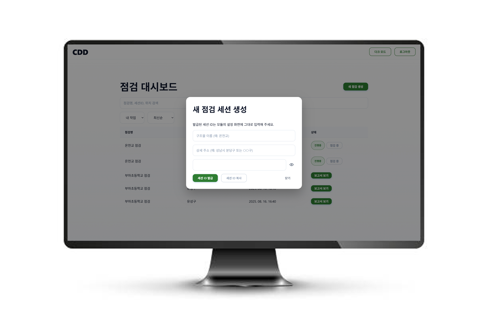
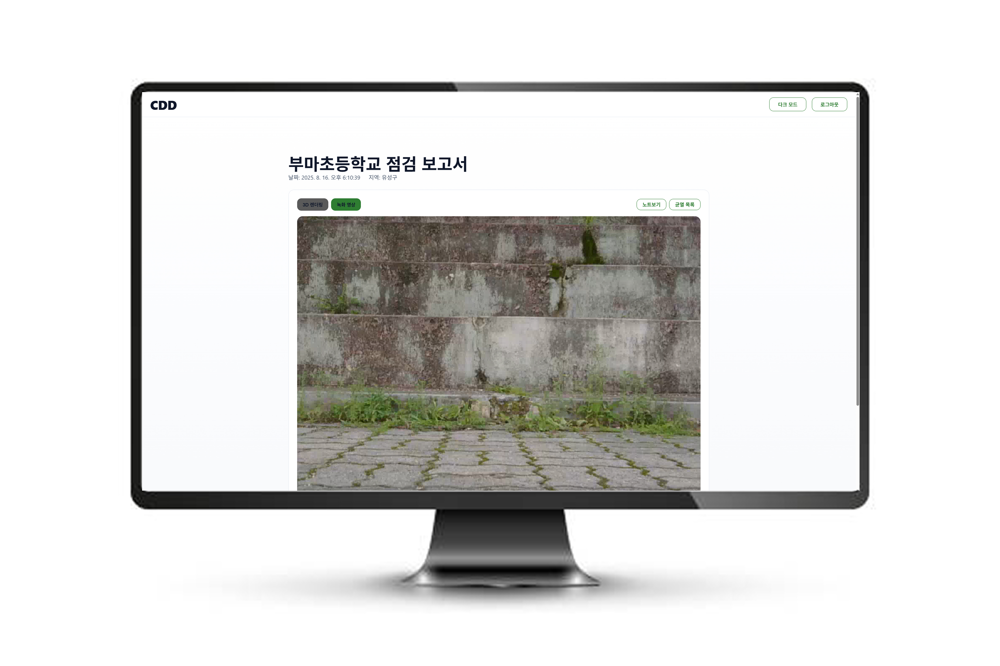
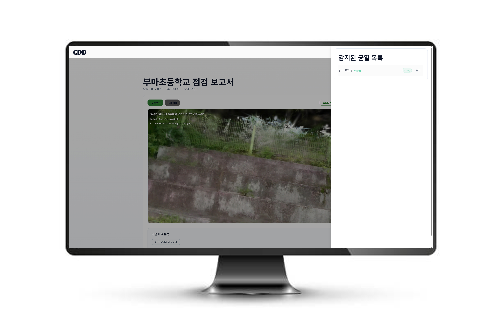
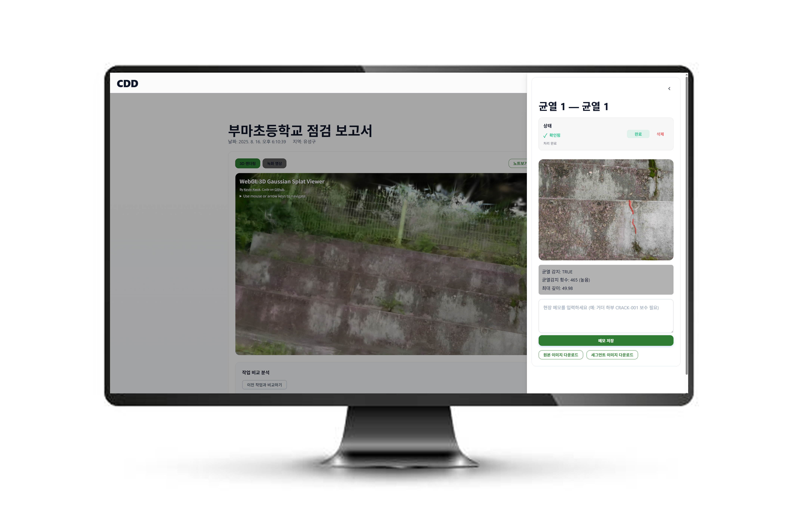
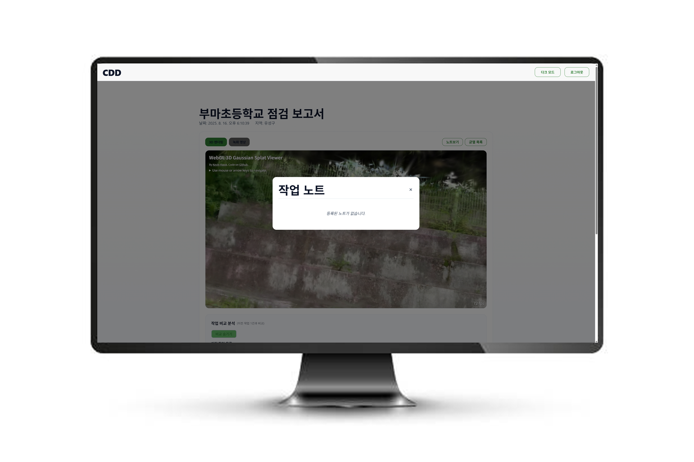
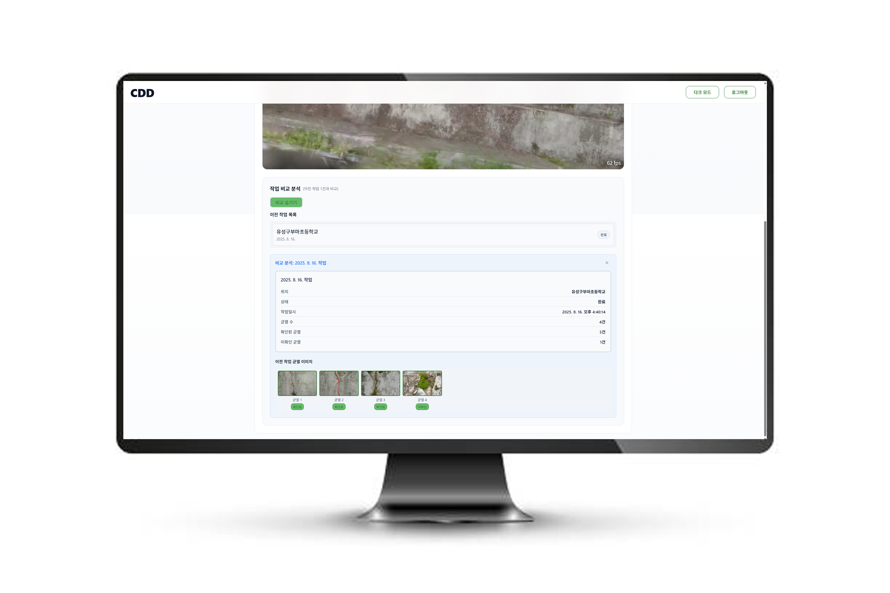
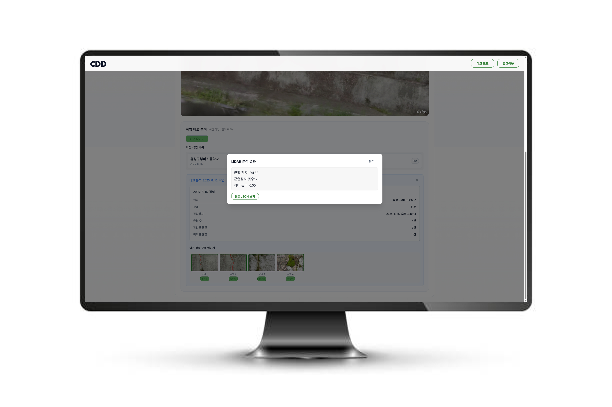
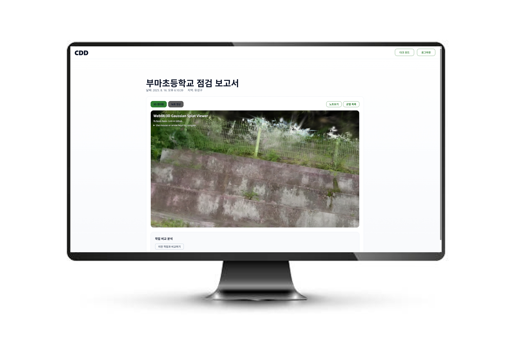
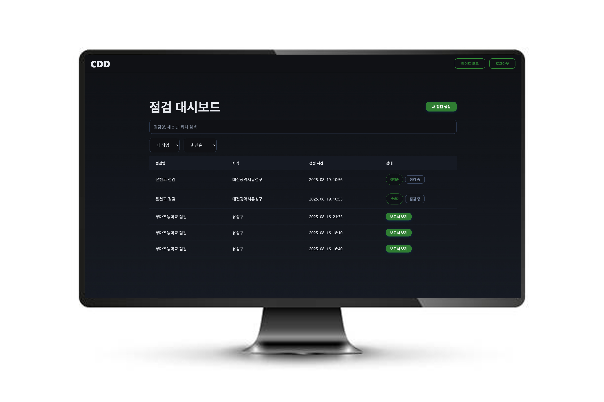
